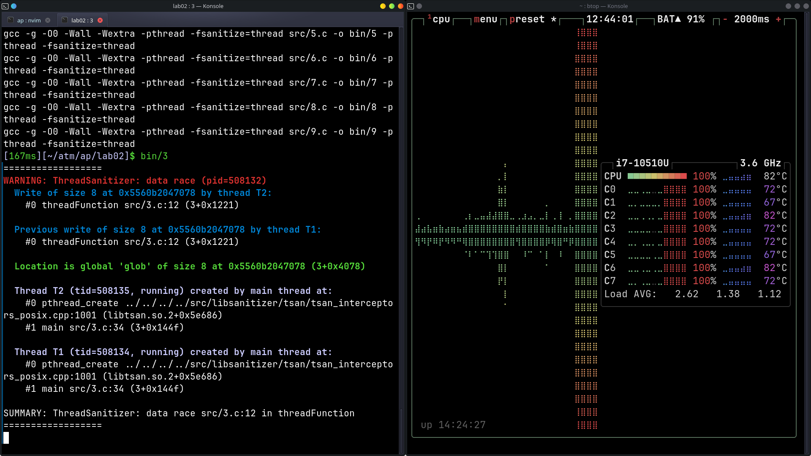

# Lab 2 

## 1. Hello
Sursa in `src/1.c`

## 2. Debugging
Compilare din terminal + vim/neovim:
- Compilare cu:
    - `CFLAGS = -g -O0 -Wall -Wextra -pthread -fsanitize=thread`
    - `LDFLAGS = -pthread -fanitize=thread`
- Debugging cu:
    - helgrind: `valgrind --tool=helgrind bin/exec`
    - gdb/gef

## 3. Use all CPU
Sursa in `src/3.c`

## 4. Add vectors parallel
Sursa in `src/4.c`

## 5. Add vectors parallel comparison
Pentru `NReps = 10'000` si `N = 400'000`, avem:
| P | Time  |
|---|--------|
| 1 | 10.93s |
| 2 | 5.20s  |
| 4 | 2.67s  |
| 8 | 2.10s  |

## 6. Matrix addition
Trivial matrices addition program. Source in `src/6.c`

## 7. Matrix addition parallel
As before but distributing rows to threads. Source in `src/7.c`

## 8. Substring search
Simple substring search program. Uses `strstr`. Source in `src/8.c`

## 9. Substring search parallel
Substring search in parallel. Uses a fast `strncpm` function and pre-conditional check for fast searching.
First run the `resources/generate_big_file.sh` (you can change the `head -c` flag for the file size) and do a `echo "mystring" >> resources/bigfile.txt`.
Execute program with `src/9 reosurces/myfile.txt mystring P`.
Times with different thread counts:
| P | Time (s) |
|---|-----------|
| 1 | 4.11      |
| 2 | 2.70      |
| 4 | 1.78      |
| 8 | 1.73      |
